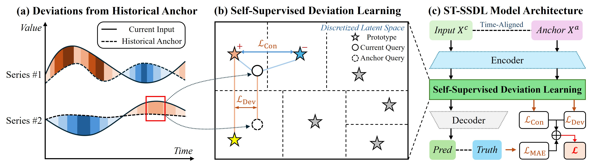
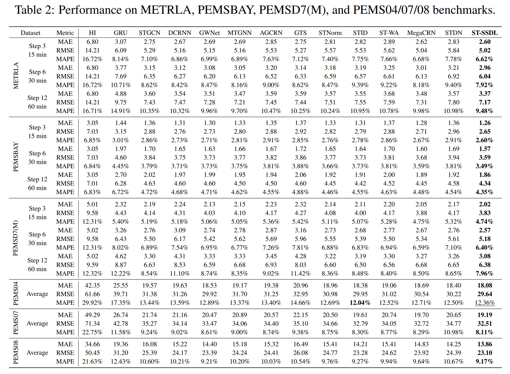

# <div align="center">[NeurIPS 2025] How Different from the Past? Spatio-Temporal Time Series Forecasting with Self-Supervised Deviation Learning </div>

* ### ST-SSDL Framework:



## Preprint Link 
[](https://arxiv.org/abs/2510.04908)
* ### OS

  Linux systems (*e.g.* Ubuntu and CentOS). 

* ### Python

  The code is built based on Python 3.9. You can install required packages using pip:

  ```
  pip install -r requirements.txt
  ```

* ### Datasets

  All six datasets are already provided. The PEMS-BAY dataset is provided in zip file due to the limitation of file size. You just need to unzip the file in the PEMSBAY folder.
  
* Run following commands to prepare data:

  ```bash
  python generate_training_data_his_BAY.py
  python generate_training_data_his_LA.py
  python generate_training_data_his_PEMS.py --dataset PEMS04
  python generate_training_data_his_PEMS.py --dataset PEMS07
  python generate_training_data_his_PEMS.py --dataset PEMS08
  python generate_training_data_his_D7.py --dataset PEMSD7M
  ```

* Then train the model with following commands:

  ```bash
  cd model_STSSDL
  python train_STSSDL.py --gpu 0 --dataset METRLA
  python train_STSSDL.py --gpu 0 --dataset PEMSBAY
  python train_STSSDL.py --gpu 0 --dataset PEMSD7M
  python train_STSSDL.py --gpu 0 --dataset PEMS04
  python train_STSSDL.py --gpu 0 --dataset PEMS07
  python train_STSSDL.py --gpu 0 --dataset PEMS08
  
  ```

  ##  Performance on Spatiotemporal Forecasting Benchmarks


